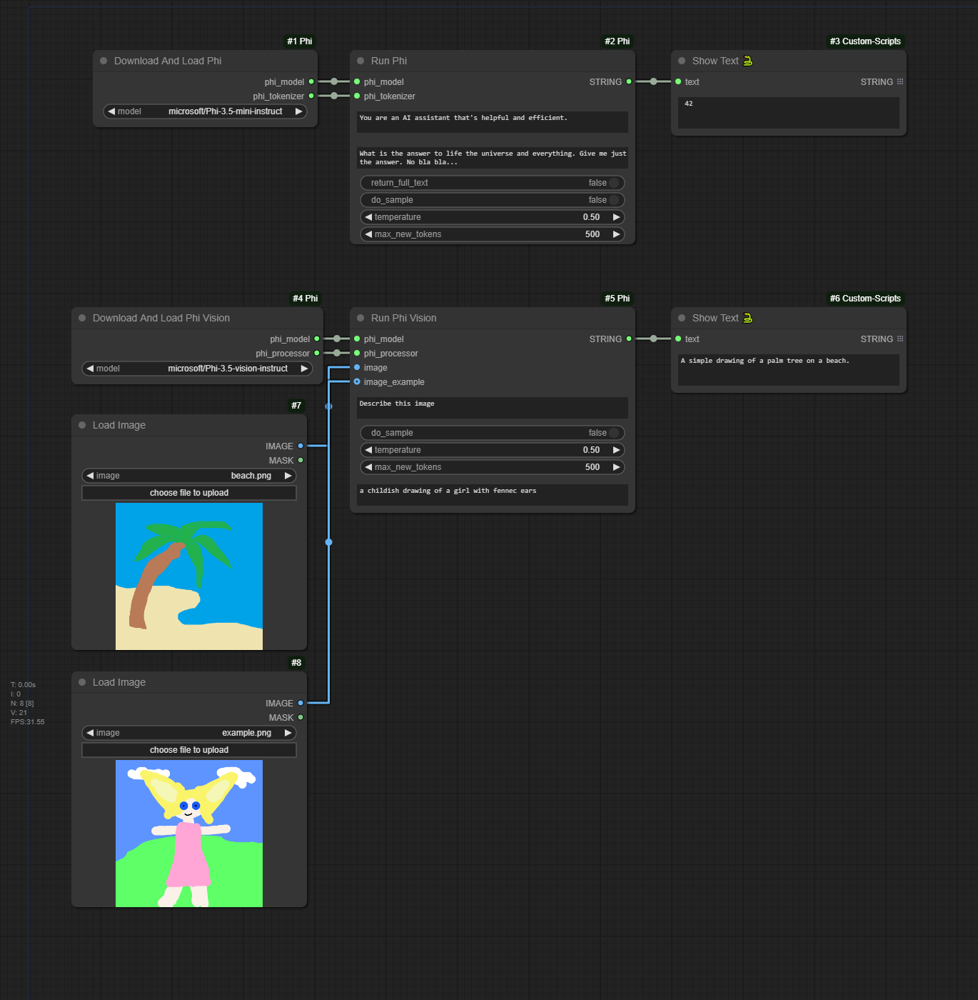

# ComfyUI Phi

Custom ComfyUI nodes to run Microsoft's Phi models. Supported versions:

- [microsoft/Phi-3.5-mini-instruct](https://huggingface.co/microsoft/Phi-3.5-mini-instruct)
- [microsoft/Phi-3.5-vision-instruct](https://huggingface.co/microsoft/Phi-3.5-vision-instruct)
- **To Be Done**: [microsoft/Phi-3.5-MoE-instruct](https://huggingface.co/microsoft/Phi-3.5-MoE-instruct)

## Getting started

Download the model files manually from the link above and place them in their corresponding folders like this:

* `.\ComfyUI\models\microsoft\Phi-3.5-mini-instruct\`
* `.\ComfyUI\models\microsoft\Phi-3.5-vision--instruct\`

Go to the ComfyUI folder `.\ComfyUI\custom_nodes`, clone this repository and install Python dependencies:

```sh
# Clone repo
git clone https://github.com/alexisrolland/ComfyUI-Phi.git

# Install dependencies
..\..\python_embeded\python.exe -s -m pip install -r .\ComfyUI-Phi\requirements.txt
```

## Updates

* `3.0.0`: Enforce manual download of model files for cleaner file organization.
* `2.0.0`: This major version introduces new inputs to provide a pair of image and response examples to the node Run Phi Vision.

## Example

Drag and drop the image in ComfyUI to reload the workflow.

