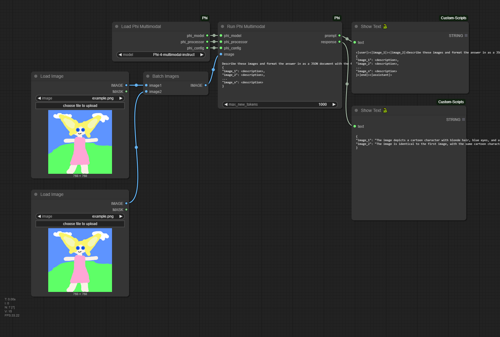
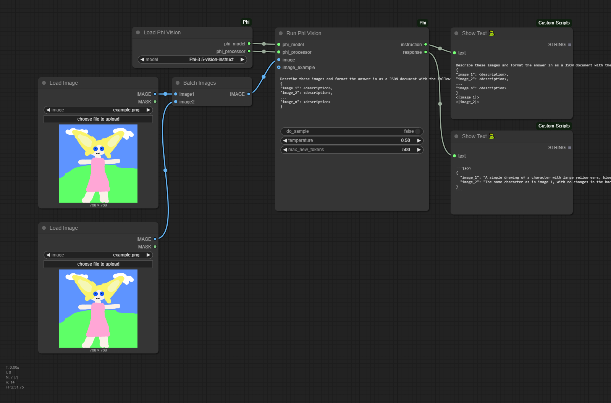
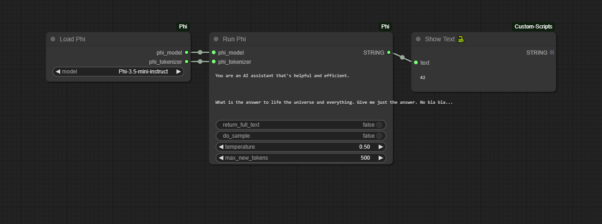

# ComfyUI Phi

Custom ComfyUI nodes to run Microsoft's Phi models. Supported versions:

- [Lexius/Phi-3.5-mini-instruct](https://huggingface.co/Lexius/Phi-3.5-mini-instruct)
- [Lexius/Phi-3.5-vision-instruct](https://huggingface.co/Lexius/Phi-3.5-vision-instruct)
- [microsoft/Phi-4-multimodal-instruct](https://huggingface.co/microsoft/Phi-4-multimodal-instruct)

> Phi 3.5 models have been forked to correct the issue 'DynamicCache' object has no attribute 'get_max_length'

## Getting started

Download the model files from the link above and place them in their corresponding folders like this:

* `.\ComfyUI\models\microsoft\Phi-3.5-mini-instruct\`
* `.\ComfyUI\models\microsoft\Phi-3.5-vision-instruct\`
* `.\ComfyUI\models\microsoft\Phi-4-multimodal-instruct\`

You can download the files with the followng commands:

```sh
# Got to Microsoft models folder
cd .\ComfyUI\models\microsoft

git clone https://huggingface.co/microsoft/Phi-3.5-mini-instruct
git clone https://huggingface.co/microsoft/Phi-3.5-vision-instruct
git clone https://huggingface.co/microsoft/Phi-4-multimodal-instruct
```

Go to the ComfyUI folder `.\ComfyUI\custom_nodes`, clone this repository and install Python dependencies:

```sh
# Clone repo
git clone https://github.com/alexisrolland/ComfyUI-Phi.git

# Install dependencies
..\..\python_embeded\python.exe -s -m pip install -r .\ComfyUI-Phi\requirements.txt

# For Windows users download Flash Attention wheel for Python 3.12
https://huggingface.co/lldacing/flash-attention-windows-wheel/resolve/main/flash_attn-2.7.4%2Bcu126torch2.6.0cxx11abiFALSE-cp312-cp312-win_amd64.whl

# Install Flash Attention
..\..\python_embeded\python.exe -s -m pip install flash_attn-2.7.4%2Bcu126torch2.6.0cxx11abiFALSE-cp312-cp312-win_amd64.whl
```

## Updates

* `4.0.2`: Add support for loading model via `extra_model_paths.yaml`.
* `4.0.0`: Add support for Phi-4-multimodal-instruct.
* `3.0.0`: Enforce manual download of model files for cleaner file organization.
* `2.0.0`: This major version introduces new inputs to provide a pair of image and response examples to the node Run Phi Vision.

## Examples

Drag and drop the image in ComfyUI to reload the workflow.

### Example Phi Multimodal



### Example Phi Vision



### Example Phi


